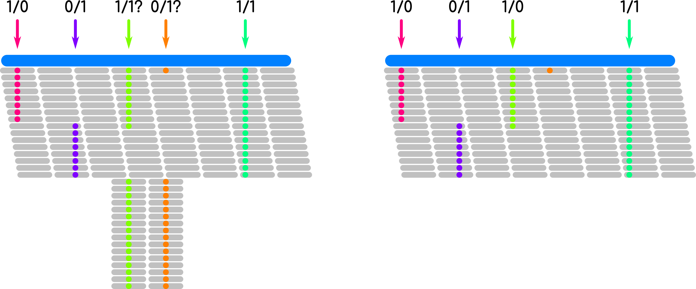

Introducción
------------
Ya tenemos nuestras lecturas alineadas, ya nos quitamos las regiones problemáticas. Es hora de llamar variantes!

Instalación de GATK
-------------------

1. Vamos a nuestro directorio :code:`$HOME`, as usual

::

	$ cd $HOME

2. Bajamos la versión actual de GATK4

.. important::

	Algunos comandos cambian ligeramente entre versiones, de modo que si quieres replicar los comandos de esta documentación, debes bajar la versión 4.1.9.0 de GATK

	::

		$ wget https://github.com/broadinstitute/gatk/releases/download/4.1.9.0/gatk-4.1.9.0.zip

3. Descomprimimos

::

	$ unzip gatk-4.1.9.0.zip

4. Agregamos la carpeta de GATK a nuestro PATH

.. danger::

	Recuerda que los cambios al PATH son potencialmente peligrosos, estos comandos debes ejecutarlos una sola vez

	::

		$ echo "PATH=\$HOME/gatk-4.1.9.0:\$PATH" >> $HOME/.bashrc

	::

		$ echo "export PATH" >> $HOME/.bashrc

	::

		$ echo "source \$HOME/gatk-4.1.9.0/gatk-completion.sh" >> $HOME/.bashrc

5. Reiniciamos sesión en la instancia

Moviendole a los alineamientos
------------------------------

Antes de realizar el llamado de variantes, debemos hacer algunos pasos de recalibración, esto es importante ya que en aplicaciones de salud debemos ser capaces de garantizar que los hallazgos son de buena calidad y que pueden ser accionables.

1. Preparamos el escenario

::

	$ cd $HOME

::

	$ ln -s /usr/local/bioinformatics/bundle .

::

	$ mkdir -p $HOME/04_gatk

::

	$ cd $HOME/04_gatk

2. Necesitamos el archivo de coordenadas para que GATK sepa donde buscar

::

	$ cp $HOME/00_other/TSO_xt_hg38.bed .

3. Necesitamos el archivo de alineamiento de lecturas y también su índice

::

	$ ln -s $HOME/03_bwa/S3.bam .

::

	$ ln -s $HOME/03_bwa/S3.bam.bai .

4. Primero agregamos un *readgroup* a nuestro archivo BAM para que en este archivo quede explicito:

* El identificador del *readgroup*
* El nombre de la biblioteca
* La plataforma de secuenciación
* El nombre de la muestra
* La unidad de la plataforma (barcodes)

::

	$ gatk AddOrReplaceReadGroups \
	  --INPUT S3.bam \
	  --OUTPUT S3.rg.bam \
	  --RGLB S3 \
	  --RGID S3 \
	  --RGPL Illumina \
	  --RGSM S3 \
	  --RGPU S3

.. admonition:: Readgroups?
	:class: toggle

		"There is no formal definition of what a 'read group' is, however in practice this term refers to a set of reads that are generated from a single run of a sequencing instrument."

		Aquí te dejamos un `link <https://gatk.broadinstitute.org/hc/en-us/articles/360035890671-Read-groups>`_ con más información.

5. Ya que tenemos nuestro bam con readgroup, volvemos a ordenar nuestras lecturas

::

	$ gatk SortSam \
	  --INPUT S3.rg.bam \
	  --OUTPUT S3.sorted.bam \
	  --SORT_ORDER coordinate

6. La importancia de ser único y diferente

Con el siguiente comando podemos eliminar duplicados ópticos o de PCR

::

	$ gatk MarkDuplicates \
	  --INPUT S3.sorted.bam \
	  --OUTPUT S3.dupmarked.bam \
	  --METRICS_FILE S3.dupmarked.txt \
	  --CREATE_INDEX true

.. warning::

	En paneles de secuenciación dirigida, en análisis de genoma mitocondrial, en búsqueda de variantes de número de copia, y en GBS; el paso de desduplicación no se recomienda!

7. Si trabajamos con organismos módelo, si tenemos estudios previos de llamado de variantes, podemos mejorar muchísimo el desempeño de los programas indicándoles el camino a seguir

7.1 Análisis de la distribución de scores de calidad

::

	$ gatk BaseRecalibrator \
	  --reference $HOME/bundle/Homo_sapiens_assembly38.fasta \
	  --input S3.dupmarked.bam \
	  --known-sites $HOME/bundle/Homo_sapiens_assembly38.dbsnp138.vcf \
	  --known-sites $HOME/bundle/Mills_and_1000G_gold_standard.indels.hg38.vcf.gz \
	  --output S3_recal-data.table \
	  --intervals TSO_xt_hg38.bed

7.2 Recalibración de los scores de calidad

::

	$ gatk ApplyBQSR \
	  --reference $HOME/bundle/Homo_sapiens_assembly38.fasta \
	  --input S3.dupmarked.bam \
	  --bqsr-recal-file S3_recal-data.table \
	  --output S3_recal-reads.bam \
	  --intervals TSO_xt_hg38.bed

7.3 Análisis de la distribución de scores de calidad post recalibración

::

	$ gatk BaseRecalibrator \
	  --reference $HOME/bundle/Homo_sapiens_assembly38.fasta \
	  --input S3_recal-reads.bam \
	  --known-sites $HOME/bundle/Homo_sapiens_assembly38.dbsnp138.vcf \
	  --known-sites $HOME/bundle/Mills_and_1000G_gold_standard.indels.hg38.vcf.gz \
	  --output S3_post-recal-data.table \
	  --intervals TSO_xt_hg38.bed

7.4 Verificación del efecto de la recalibración

::

	$ gatk AnalyzeCovariates \
	  --before-report-file S3_recal-data.table \
	  --after-report-file S3_post-recal-data.table \
	  --plots-report-file S3_recal-plots.pdf

.. warning::

	Si no tienes datos previos, si tu reacción de secuenciación salio de libro de texto, si trabajas con organismos no módelo, este paso es omisible

Llamado de variantes, finally (?)
---------------------------------

Una vez que tenemos las lecturas listas, recalibradas, marcadas, desduplicadas, etc. Podemos ahora si llamar las variantes

1. Obtención de variantes crudas

::

	$ gatk HaplotypeCaller \
	  --reference $HOME/bundle/Homo_sapiens_assembly38.fasta \
	  --input S3_recal-reads.bam \
	  --intervals TSO_xt_hg38.bed \
	  --stand-call-conf 10.0 \
	  --output S3_raw-vars.vcf

2. Si trabajamos con organismos módelo, si tenemos estudios previos de llamado de variantes, podemos mejorar muchísimo el desempeño de los programas indicándoles el camino a seguir

2.1 Análisis de la distribución de scores de calidad: SNVs

::

	$ gatk VariantRecalibrator \
	  --reference $HOME/bundle/Homo_sapiens_assembly38.fasta \
	  --variant S3_raw-vars.vcf \
	  --intervals TSO_xt_hg38.bed \
	  --resource:hapmap,known=false,training=true,truth=true,prior=15.0 $HOME/bundle/hapmap_3.3.hg38.vcf.gz \
	  --resource:omni,known=false,training=true,truth=true,prior=12.0 $HOME/bundle/1000G_omni2.5.hg38.vcf.gz \
	  --resource:1000G,known=false,training=true,truth=false,prior=10.0 $HOME/bundle/1000G_phase1.snps.high_confidence.hg38.vcf.gz \
	  --resource:dbsnp,known=true,training=false,truth=false,prior=2.0 $HOME/bundle/Homo_sapiens_assembly38.dbsnp138.vcf \
	  --use-annotation QD \
	  --use-annotation FS \
	  --use-annotation SOR \
	  --use-annotation MQ \
	  --use-annotation MQRankSum \
	  --use-annotation ReadPosRankSum \
	  --mode SNP \
	  --truth-sensitivity-tranche 100.0 \
	  --truth-sensitivity-tranche 99.9 \
	  --truth-sensitivity-tranche 99.0 \
	  --truth-sensitivity-tranche 90.0 \
	  --max-gaussians 1 \
	  --max-negative-gaussians 1 \
	  --output S3_recalibrate-SNP.recal \
	  --tranches-file S3_recalibrate-SNP.tranches \
	  --rscript-file S3_recalibrate-SNP-plots.R

2.2 Recalibración de variantes: SNVs

::

	$ gatk ApplyVQSR \
	  --reference $HOME/bundle/Homo_sapiens_assembly38.fasta \
	  --variant S3_raw-vars.vcf \
	  --intervals TSO_xt_hg38.bed \
	  --mode SNP \
	  --truth-sensitivity-filter-level 99.0 \
	  --recal-file S3_recalibrate-SNP.recal \
	  --tranches-file S3_recalibrate-SNP.tranches \
	  --output S3_recal-snps_raw-indels.vcf

2.3 Análisis de la distribución de scores de calidad: InDels

::

	$ gatk VariantRecalibrator \
	  --reference $HOME/bundle/Homo_sapiens_assembly38.fasta \
	  --variant S3_recal-snps_raw-indels.vcf \
	  --intervals TSO_xt_hg38.bed \
	  --resource:mills,known=true,training=true,truth=true,prior=12.0 $HOME/bundle/Mills_and_1000G_gold_standard.indels.hg38.vcf.gz \
	  --use-annotation QD \
	  --use-annotation FS \
	  --use-annotation SOR \
	  --use-annotation MQRankSum \
	  --use-annotation ReadPosRankSum \
	  --mode INDEL \
	  --truth-sensitivity-tranche 100.0 \
	  --truth-sensitivity-tranche 99.9 \
	  --truth-sensitivity-tranche 99.0 \
	  --truth-sensitivity-tranche 90.0 \
	  --max-gaussians 1 \
	  --max-negative-gaussians 1 \
	  --output S3_recalibrate-INDEL.recal \
	  --tranches-file S3_recalibrate-INDEL.tranches \
	  --rscript-file S3_recalibrate-INDEL-plots.R

2.4 Recalibración de variantes: InDels

::

	$ gatk ApplyVQSR \
	  --reference $HOME/bundle/Homo_sapiens_assembly38.fasta \
	  --variant S3_recal-snps_raw-indels.vcf \
	  --intervals TSO_xt_hg38.bed \
	  --mode INDEL \
	  --truth-sensitivity-filter-level 99.0 \
	  --recal-file S3_recalibrate-INDEL.recal \
	  --tranches-file S3_recalibrate-INDEL.tranches \
	  --output S3_recalibrated_variants.vcf

Análisis preliminar de mis variantes
------------------------------------

Ahora que tenemos nuestras variantes con los scores de calidad adecuados, qué sigue?
El primer paso es ponerles nombre y apellido a las variantes que encontremos

1. Annotación inicial: GATK + dbSNP

::

	$ gatk VariantAnnotator \
	  --reference $HOME/bundle/Homo_sapiens_assembly38.fasta \
	  --variant S3_recalibrated_variants.vcf \
	  --intervals TSO_xt_hg38.bed \
	  --dbsnp $HOME/bundle/Homo_sapiens_assembly38.dbsnp138.vcf \
	  --output S3_annotated_variants.vcf \
	  --annotation Coverage

Selección de variantes
----------------------

Tradicionalmente cuando eliminamos elementos de un dataset, llamamos a este proceso como "filtrado" ya que eliminamos elementos que cumplan cierto critero.

En el argot de GATK las cosas son distintas, para GATK, el filtrado de las variantes implica unicamente etiquetar los elementos que cumplan tal o cual característica.

Después de este largo camino, tenemos variantes, pero no todas son de buena calidad, a pesar de que empleamos muchos puntos de control.

1. Selección de variantes de buena calidad y de buena profundidad

::

	$ gatk SelectVariants \
	  --reference $HOME/bundle/Homo_sapiens_assembly38.fasta \
	  --variant S3_annotated_variants.vcf \
	  --output S3_annotated_qd_dp_filtered_variants.vcf \
	  --selectExpressions "QD > 5.0 && DP > 10.0"

Formatos... formatos everywhere
-------------------------------

.. admonition:: BAM
	:class: toggle

	El formato BAM es similar en estructura al formato SAM, sin embargo, es el formato de elección para el manejo de alineamientos ya que está comprimido y ahorra mucho espacio

.. admonition:: BED
	:class: toggle

	El formato BED consta de archivos de texto plano con estructura tabular que indica posiciones dentro de un genoma

	Este formato es indispensable para el manejo óptimo de alineamientos ya que nos permite filtrar unicamente por las regiones que nos interesan!

	Hay distintas versiones del formato `BED`_, la estructura más básica consta de 4 a 6 columnas::

		13      32316459        32316526        BRCA2   .       +
		13      32319075        32319324        BRCA2   .       +
		13      32325074        32325183        BRCA2   .       +

	.. important::

		El formato BED es 0-based para la segunda columna!

		Si mi gen inicia en el nucleótido 345 y termina en el 678 del cromosoma MT, su nomenclatura en formato BED será la siguiente::

			MT	344	678	mi_gen	.	+

.. admonition:: VCF
	:class: toggle

	El formato VCF también es un archivo de texto plano con una estructura tabular::

		#CHROM  POS     ID      REF     ALT     QUAL    FILTER  INFO    FORMAT  g204
		1       13417   rs777038595     C       CGAGA   324.73  PASS    AC=1;AF=0.500;AN=2;BaseQRankSum=0.583;DB;DP=26;ExcessHet=3.0103;FS=0.000;MLEAC=1;MLEAF=0.500;MQ=22.21;MQRankSum=-0.032;QD=12.49;ReadPosRankSum=-2.185;SOR=0.446;VQSLOD=0.698;culprit=ReadPosRankSum GT:AD:DP:GQ:PL  0/1:15,11:26:99:362,0,634

	.. admonition:: Descripción extendida del formato vcf
		:class: toggle

			+---------+-----------------------+-------------------------------------------------------------------------------------------------------------------------------------------------------------------------------------+
			+1: CHROM +1                      +Cromosoma en dónde se ubica la variante                                                                                                                                              +
			+---------+-----------------------+-------------------------------------------------------------------------------------------------------------------------------------------------------------------------------------+
			+2: POS   +1053827                +Posición de la variante en el cromosoma                                                                                                                                              +
			+---------+-----------------------+-------------------------------------------------------------------------------------------------------------------------------------------------------------------------------------+
			+3: ID    +rs74685771             +Identificador de la variante                                                                                                                                                         +
			+---------+-----------------------+-------------------------------------------------------------------------------------------------------------------------------------------------------------------------------------+
			+4: REF   +G                      +Alelo de referencia                                                                                                                                                                  +
			+---------+-----------------------+-------------------------------------------------------------------------------------------------------------------------------------------------------------------------------------+
			+5: ALT   +C                      +Alelo encontrado en la muestra                                                                                                                                                       +
			+---------+-----------------------+-------------------------------------------------------------------------------------------------------------------------------------------------------------------------------------+
			+6: QUAL  +856.77                 +Score de calidad de la variante                                                                                                                                                      +
			+---------+-----------------------+-------------------------------------------------------------------------------------------------------------------------------------------------------------------------------------+
			+7: FILTER+PASS                   +Flag de calidad de la variante                                                                                                                                                       +
			+---------+-----------------------+-------------------------------------------------------------------------------------------------------------------------------------------------------------------------------------+
			+8:INFO   +AC=1;                  +Número de alelos alternos encontrados                                                                                                                                                +
			+         +-----------------------+-------------------------------------------------------------------------------------------------------------------------------------------------------------------------------------+
			+         +AF=0.500;              +Frecuencia alelica (alelo alterno)                                                                                                                                                   +
			+         +-----------------------+-------------------------------------------------------------------------------------------------------------------------------------------------------------------------------------+
			+         +AN=2;                  +Número total de alelos para una variante                                                                                                                                             +
			+         +-----------------------+-------------------------------------------------------------------------------------------------------------------------------------------------------------------------------------+
			+         +BaseQRankSum=-2.129    +Z-score de la calidad de las bases mapeadas en el alelo alterno vs el alelo de referencia empleando una prueba de Wilcoxon                                                           +
			+         +-----------------------+-------------------------------------------------------------------------------------------------------------------------------------------------------------------------------------+
			+         +ClippingRankSum=-0.286;+Z-score del número de lecturas con calidad de mapeo bajas para el alelo alterno vs el alelo de referencia empleando una prueba de Wilcoxon                                           +
			+         +-----------------------+-------------------------------------------------------------------------------------------------------------------------------------------------------------------------------------+
			+         +DB;                    +Indica si la variante pertenece a una base de datos (dbSNP)                                                                                                                          +
			+         +-----------------------+-------------------------------------------------------------------------------------------------------------------------------------------------------------------------------------+
			+         +DP=63;                 +número de lecturas mapeadas en la posición de la variante                                                                                                                            +
			+         +-----------------------+-------------------------------------------------------------------------------------------------------------------------------------------------------------------------------------+
			+         +FS=0;                  +P-value ajustado para determinar sesgo hacía una cadena de DNA empleando una prueba exacta de Fisher                                                                                 +
			+         +-----------------------+-------------------------------------------------------------------------------------------------------------------------------------------------------------------------------------+
			+         +MLEAC=1;               +Máxima verosimilitud esperada para el número de alelos observados (depende del número de muestras).                                                                                  +
			+         +-----------------------+-------------------------------------------------------------------------------------------------------------------------------------------------------------------------------------+
			+         +MLEAF=0.500;           +Máxima verosimilitud esperada para las frecuencias alélicas (depende del número de muestras).                                                                                        +
			+         +-----------------------+-------------------------------------------------------------------------------------------------------------------------------------------------------------------------------------+
			+         +MQ=60.00;              +Calidad media de mapeo en la posición de la variante.                                                                                                                                +
			+         +-----------------------+-------------------------------------------------------------------------------------------------------------------------------------------------------------------------------------+
			+         +MQRankSum=-0.0.635;    +Z-score de la calidad de mapeo las bases alíneadas en el alelo alterno vs el alelo de referencia empleando una prueba de Wilcoxon                                                    +
			+         +-----------------------+-------------------------------------------------------------------------------------------------------------------------------------------------------------------------------------+
			+         +QD=13.60;              +Confianza del alelo observado (Quality over depth)                                                                                                                                   +
			+         +-----------------------+-------------------------------------------------------------------------------------------------------------------------------------------------------------------------------------+
			+         +ReadPosRankSum=0.621;  +Z-score del sesgo posicional (con respecto de la longitud de la lectura) del alelo alternativo vs el alelo de referencia (depende del número de muestras)                            +
			+         +-----------------------+-------------------------------------------------------------------------------------------------------------------------------------------------------------------------------------+
			+         +SOR=0.768;             +Suma simétrica de la razón de momios del número de lecturas que presentan la variante cerca del final de la lectura, vs las lecturas que la presentan cerca del inicio de la lectura.+
			+         +-----------------------+-------------------------------------------------------------------------------------------------------------------------------------------------------------------------------------+
			+         +VQSLOD=3.39;           +Logaritmo de la razón de momios de que la variante sea verdadera vs que sea un falso positivo.                                                                                       +
			+         +-----------------------+-------------------------------------------------------------------------------------------------------------------------------------------------------------------------------------+
			+         +culprit=qd             +El descriptor que presentó la métrica más desfavorable                                                                                                                               +
			+---------+-----------------------+-------------------------------------------------------------------------------------------------------------------------------------------------------------------------------------+
			+9:FORMAT +GT                     +Genotipo                                                                                                                                                                             +
			+         +-----------------------+-------------------------------------------------------------------------------------------------------------------------------------------------------------------------------------+
			+         +AD                     +Profundidad de los alelos observados (Ref,Alt)                                                                                                                                       +
			+         +-----------------------+-------------------------------------------------------------------------------------------------------------------------------------------------------------------------------------+
			+         +DP                     +Profundidad total (número de lecturas                                                                                                                                                +
			+         +-----------------------+-------------------------------------------------------------------------------------------------------------------------------------------------------------------------------------+
			+         +GQ                     +Calidad del genotipado                                                                                                                                                               +
			+         +-----------------------+-------------------------------------------------------------------------------------------------------------------------------------------------------------------------------------+
			+         +PL                     +Verosimilitud de genotipos (Obs,Nul,Alt)                                                                                                                                             +
			+---------+-----------------------+-------------------------------------------------------------------------------------------------------------------------------------------------------------------------------------+
			+10:g204  +0/1                    +Heterocigoto                                                                                                                                                                         +
			+         +-----------------------+-------------------------------------------------------------------------------------------------------------------------------------------------------------------------------------+
			+         +37,26                  +(G)37 reads \+ (C)26 reads                                                                                                                                                           +
			+         +-----------------------+-------------------------------------------------------------------------------------------------------------------------------------------------------------------------------------+
			+         +63                     +                                                                                                                                                                                     +
			+         +-----------------------+-------------------------------------------------------------------------------------------------------------------------------------------------------------------------------------+
			+         +99                     +                                                                                                                                                                                     +
			+         +-----------------------+-------------------------------------------------------------------------------------------------------------------------------------------------------------------------------------+
			+         +885,0,1386             +                                                                                                                                                                                     +
			+---------+-----------------------+-------------------------------------------------------------------------------------------------------------------------------------------------------------------------------------+

	.. important::

		El formato VCF es 1-based en la segunda columna, por lo que es importante considerar esto cuando manejemos combinaciones de formatos (como con bedtools y bcftools)

.. admonition:: GFF
	:class: toggle

	El formato GFF consta de archivos de texto plano con estructura tabular que indica posiciones dentro de un genoma, pueden ser genes, mRNAs, exones, regiones codificantes, y un largo etcetera.

	Este formato es uno de los estándares de anotación genómica y se emplea en todos los proyectos de genómica como referencia para obtener genes

	::

		1	havana	exon	11869	12227	.	+	.	Parent=transcript:ENST00000456328;Name=ENSE00002234944;constitutive=0;ensembl_end_phase=-1;ensembl_phase=-1;exon_id=ENSE00002234944;rank=1;version=1
		1	havana	lnc_RNA	11869	14409	.	+	.	ID=transcript:ENST00000456328;Parent=gene:ENSG00000223972;Name=DDX11L1-202;biotype=processed_transcript;tag=basic;transcript_id=ENST00000456328;transcript_support_level=1;version=2
		1	havana	pseudogene	11869	14409	.	+	.	ID=gene:ENSG00000223972;Name=DDX11L1;biotype=transcribed_unprocessed_pseudogene;description=DEAD/H-box helicase 11 like 1 [Source:HGNC Symbol%3BAcc:HGNC:37102];gene_id=ENSG00000223972;logic_name=havana_homo_sapiens;version=5
		1	havana	exon	12010	12057	.	+	.	Parent=transcript:ENST00000450305;Name=ENSE00001948541;constitutive=0;ensembl_end_phase=-1;ensembl_phase=-1;exon_id=ENSE00001948541;rank=1;version=1
		1	havana	pseudogenic_transcript	12010	13670	.	+	.	ID=transcript:ENST00000450305;Parent=gene:ENSG00000223972;Name=DDX11L1-201;biotype=transcribed_unprocessed_pseudogene;tag=basic;transcript_id=ENST00000450305;transcript_support_level=NA;version=2
		1	havana	exon	12179	12227	.	+	.	Parent=transcript:ENST00000450305;Name=ENSE00001671638;constitutive=0;ensembl_end_phase=-1;ensembl_phase=-1;exon_id=ENSE00001671638;rank=2;version=2
		1	havana	exon	12613	12697	.	+	.	Parent=transcript:ENST00000450305;Name=ENSE00001758273;constitutive=0;ensembl_end_phase=-1;ensembl_phase=-1;exon_id=ENSE00001758273;rank=3;version=2
		1	havana	exon	12613	12721	.	+	.	Parent=transcript:ENST00000456328;Name=ENSE00003582793;constitutive=0;ensembl_end_phase=-1;ensembl_phase=-1;exon_id=ENSE00003582793;rank=2;version=1
		1	havana	exon	12975	13052	.	+	.	Parent=transcript:ENST00000450305;Name=ENSE00001799933;constitutive=0;ensembl_end_phase=-1;ensembl_phase=-1;exon_id=ENSE00001799933;rank=4;version=2
		1	havana	exon	13221	13374	.	+	.	Parent=transcript:ENST00000450305;Name=ENSE00001746346;constitutive=0;ensembl_end_phase=-1;ensembl_phase=-1;exon_id=ENSE00001746346;rank=5;version=2

	La estructura del formato GFF consta de 9 columnas:

			+------------+-----------------------------------+
			+ Campo      + Ejemplo                           +
			+============+===================================+
			+1: CHROM    + 1                                 +
			+------------+-----------------------------------+
			+2: SOURCE   + havana                            +
			+------------+-----------------------------------+
			+3: FEATURE  + exon                              +
			+------------+-----------------------------------+
			+4: START    + 13221                             +
			+------------+-----------------------------------+
			+5: END      + 13374                             +
			+------------+-----------------------------------+
			+6: SCORE    + \.                                +
			+------------+-----------------------------------+
			+7: STRAND   + \+                                +
			+------------+-----------------------------------+
			+8:FRAME     + \.                                +
			+------------+-----------------------------------+
			+9:ATTRIBUTE + Parent=transcript:ENST00000450305;+
			+            +-----------------------------------+
			+            + Name=ENSE00001746346;             +
			+            +-----------------------------------+
			+            + constitutive=0;                   +
			+            +-----------------------------------+
			+            + ensembl_end_phase=-1;             +
			+            +-----------------------------------+
			+            + ensembl_phase=-1;                 +
			+            +-----------------------------------+
			+            + exon_id=ENSE00001746346;          +
			+            +-----------------------------------+
			+            + rank=5;                           +
			+            +-----------------------------------+
			+            + version=2                         +
			+------------+-----------------------------------+

	.. important::

		El formato GFF es 1-based para la quinta columna!

.. _`BED`: https://genome.ucsc.edu/FAQ/FAQformat.html#format1
.. _`ftp`: ftp://gsapubftp-anonymous@ftp.broadinstitute.org/bundle/
