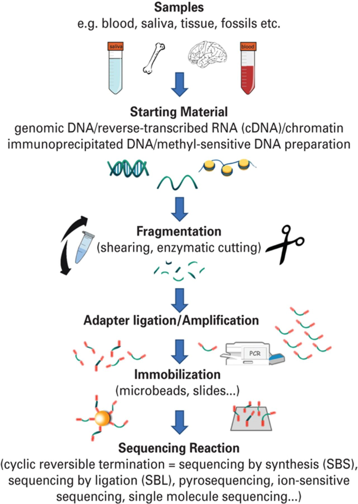

Introducción
------------
NGS es un término sombrilla que hace referencia a la última generación de tecnologías de secuenciación

Actualmente hay tres generaciones de tecnologías de secuenciación disponibles de forma comercial

	1. Primera generación: secuenciación por terminación didesoxi
		* Secuenciación Sanger en geles de acrilamida
		* Secuenciación Sanger en capilares

	2. Segunda generación: secuenciación por síntesis:
		* Roche 454
		* Illumina
		* Applied Biosystems SOLiD
		* Ion Torren / Ion Proton
	3. Tercera generación: secuenciación por lectura directa de moléculas
		* PacBio
		* Oxford Nanopore

.. image:: generations.png
	:width: 600 px

Aspectos generales de la secuenciación masiva
-----------------------------------------------

Si bien las tecnologías de secuenciación son muy diversas, el principio es fundamentalmente el mismo:

1. Se obtiene el DNA genómico de la muestra
	* El tipo de muestra determina el procedimiento a emplear (kit, consumibles, equipo)
2. El DNA genómico es fragmentado de forma semi-aleatoria
	* Fragmentación mecánica
	* Fragmentación enzimática

	Los kits de secuenciación indican el tamaño de fragmento a obtener, para exoma y genoma éstos van de 300 a 800 bp
3. Se ligan adaptadores a ambos lados de los fragmentos generados.
	En este momento tenemos bibliotecas genómicas y dependiendo de su concentración pueden estar listas para secuenciar
4. Se agregan más oligonucleótidos a ambos lados de los fragmentos generados.
	* Éste es un paso opcional pero común cuando se procesa más de una muestra por corrida
 	* En caso de no contar con la cantidad adecuada, se amplifican las bibliotecas mediante una reacción de PCR

	En este momento tenemos bibliotecas uniplex listas para combinarse y tener bibliotecas multiplex
5. La biblioteca multiplex se inmobiliza en una matriz:
	* Puede ser una superficie en el caso de Illumina, PacBio & Nanopore
	* Puede ser en perlas como en Ion Proton & 454
6. Se secuencian las bibliotecas multiplexeadas en el aparato
	* La configuración de la corrida es fundamental para obtener el mejor rendimiento de nuestros reactivos, de nuestra muestra y muy importante, de nuestros datos de secuenciación

	.. tip::

		Es recomendable secuenciar por ambos lados las bibliotecas, ya que la información de un solo lado de la lectura (75-300 nt) puede perderse en la inmensidad del genoma (3Gbp en el caso de humano)
		Es recomendable secuenciar fragmentos largos medianamente espaciados (2x150 nt + 200) para maximizar el rendimiento de la corrida, esto lo determina el laboratorio de biología molecular, los Field Application Scientists y los kits de secuenciación

Cómo se obtiene un exoma?
-------------------------
Un exoma usualmente se obtiene mediante captura de regiones específicas a través de sondas que hibridan mediante complementaridad de bases en las regiones correspondientes a los exones del organismo que estemos tratando

.. important::

	Los kits de captura para exomas humanos constan de cientos de miles de sondas que hibridan específicamente con los exones de los >20000 genes codificados en el genoma humano!

	.. image:: exome.png
		:width: 600 px

Existen otras estrategias como la de amplificación, sin embargo éstas tienen un rendimiento considerablemente inferior al de captura, adicionalmente, pueden ser susceptibles de rearreglos (captura también es sensible a rearreglos, pero no se pierden las variantes presentes en las regiones rearregladas)

Evolución en los costos de secuenciación y comparación de plataformas
---------------------------------------------------------------------

.. admonition:: Esta figura la hemos visto hasta el cansancio, pero... qué significa?

	.. image:: genome_cost.jpg
		:width: 600 px

	.. warning::

		La ley de Moore en realidad es aplicable a poder de cómputo vs costo vs tiempo. No obstante la genómica y la bioinformática van de la mano, de modo que si bien no es directamente aplicable, si podemos extrapolar la ley de Moore con respecto al costo esperado de la secuenciación de genomas.

		Esta imagen esencialmente nos indica que ahora es más fácil secuenciar genomas completos, y eso es tambien un aliciente para implementar metodologías de genoma o exoma completos por encima de las opciones de paneles específicos

.. admonition:: Y el rendimiento?

	.. image:: throughput.png
		:width: 600 px

	No todas las plataformas entregan el mismo rendimiento, incluso si son baratas, por lo que es importante no solamente elegir el kit adecuado para obtener exomas o paneles específicos. Las distintas plataformas nos van a entregar throughputs diferentes, incluso dentro de la misma plataforma en diferentes versiones, la salida de los secuenciadores puede ser muy muy variada

.. tip::

	Para secuenciación masiva de genoma y de exoma, actualmente puede usarse Illumina, Ion Proton, PacBio o Nanopore, no obstante Illumina tiene ventajas notables sobre las demás plataformas:

	* No es tan susceptible a errores en regiones homopoliméricas
	* Tiene el throughput más alto de todas las tecnologías
	* Tiene la relación más alta en costo beneficio en cuanto a costo por base secuenciada
	* Tiene mayor número de certificaciones en aplicaciones clínicas y de investigación

.. warning::

	Pese a sus ventajas, Illumina tiene deficiencias a nivel de detección de variaciones estructurales:

	* No permite la detección de rearreglos (la opción es Nanopore y PacBio)
	* No permite la detección de expansiones con la resolución adecuada (Nanopore > PacBio > Ion Proton si pueden realizar esta tarea)
	* No permite la resolución de regiones repetitivas (Nanopore y PacBio son la mejor opción)

Por lo anterior nos concentraremos en la tecnología Illumina para el llamado de variantes

Secuenciación Illumina
----------------------

.. important::

	Illumina es por mucho la principal plataforma de secuenciación masiva, no obstante las tecnologías de tercera generación pronto competirán con Illumina tanto en la clínica como en la investigación y en otras áreas en donde se apliquen estrategias de secuenciación

	.. image:: popularity.png
		:width: 600 px

.. admonition:: Cúal es la química en la secuenciación Illumina?

	.. image:: illumina_seq.png

	En la secuenciación illumina, cada fragmento se lee dos veces (una vez en *foward* y una más en *reverse*), en cada incorporación de nucleótidos, se llevan a cabo los siguientes pasos:

	* Se incorpora un nucleótido marcado con un fluoróforo específico
	* Se detiene transitoriamente la reacción
	* Se excitan los fluoróforos presentes en los nucleótidos incorporados
	* Se lee la emisión de luz correspondiente a cada nucleótido
	* Las intensidades de cada spot son registradas y transformadas en secuencias de nucleótidos

	.. note::
		La intensidad de los spots estará intimamente ligada a la capacidad del detector de separar señales ruidosas y en consecuencia de entregarnos secuencias de calidad.

Calidad de la secuenciación
---------------------------

El detector de los secuenciadores Illumina es esencialmente una cámara muy grande (muy (seriously, muy)). Cómo hace para discriminar entre una señal ruidosa de una señal real?

.. important::

	Estas son imagenes reales de reacciones de secuenciación

	.. image:: illumina_signal_to_noise.png
		:width: 600 px

	La calidad de una reacción de secuenciación está en función de la capacidad del aparato de separar el ruido de una señal ruidosa.

.. admonition:: Un poco de historia para entender la calidad de las secuencias

	.. image:: quality.png

	Cuando hacemos secuenciación Sanger podemos distinguir facilmente cuando una secuencia es de mala calidad porque los picos se traslapan con la señal basal de la fluorescencia de los demás nucleótidos

.. note::

	En secuenciación masiva ocurre similar pero lo podemos ver de una forma numérica

	.. image:: phred_scores.png

Incorporemos ahora nuestros Phred scores en una secuenciación tradicional

.. |low_qual_chrom| image:: low_qual_chrom.png
	:height: 150 px
	:alt: low qual chrom

.. |high_qual_chrom| image:: high_qual_chrom.png
	:height: 150 px
	:alt: high qual chrom

.. |high_qual_fastq| image:: high_qual_fastq.png
	:height: 150 px
	:alt: high qual fastq

+------------------+-------------------+
+ |low_qual_chrom| + |high_qual_chrom| +
+------------------+-------------------+

.. note::

	Recordemos que en cómputo, cada caracter de un *string* pesa ~1 byte

	Cuando incorporamos los phred scores en un archivo, éste pesará por lo menos el doble si se trata de secuencias de baja calidad, y podría pesar hasta el triple cuando son secuencias de alta calidad

	Puedes identificar por qué?

.. warning::

	Esto no parece ser muy problemático, si partimos de lo anterior, una secuencia de 1000 nucleótidos no excederá 1 Kb y con calidades incluidas no excederá 3 Kb

	.. important::

		Pero en secuenciación masiva tenemos millones de secuencias! Entonces el tamaño si importa.

.. admonition:: Solución al problema de codificar los phred scores en NGS
	:class: toggle

	El código ASCII es una implementación internacional que codifica caracteres alfanuméricos en una estructura controlada, cada letra tiene un identificador único y es valido internacionalmente.

	Y esto cómo conecta con la calidad?

	Dado que cada caracter (1 byte) tiene un código numérico (llegando incluso a más de 100), podemos codificar números que midan 2 bytes, en caracteres que midan unicamente 1 byte

	.. image:: phred_scale.png
		:width: 600 px

.. important::

	Sabiendo lo anterior, nuestro cromatograma lo podemos representar de la siguiente manera

	+-------------------+-------------------+
	+ |high_qual_chrom| + |high_qual_fastq| +
	+-------------------+-------------------+

.. admonition:: Y ahora en secuenciación masiva!

	.. image:: fastq_format.png

	Considerando que ya conocemos las equivalencias del código ASCII con la escala Phred, qué podrías decir de las secuencias anteriores?

	* Son de buena calidad?
	* Son de mala calidad?

	.. admonition:: Solución
		:class: toggle

		**Existen distintos *offsets* de la escala Phred!**

		Es indispensable que consultes con tu centro de secuenciación cual es el *offset* en la escala Phred de tu reacción de secuenciación!

		.. image:: phred_scales.png

.. admonition:: Y entonces tenemos fastq!

	El formato fastq es sumamente rico, ya que además de la secuencia, tenemos información de la calidad de la secuencia y más, mucho más

	.. image:: fastq_header.png

FastQC
------
Para nosotros poder examinar la calidad de nuestras secuencias, podemos medir directamente sus calidades en formato fastq, y para ello usaremos la aplicación FastQC.

* Es una aplicación escrita en Java que permite portabilidad, es decir, puede correr en Windows, Linux y OSX
* Cuenta con interfáz gráfica y también en línea de comandos
* Entrega reportes a manera de páginas web

Sabiendo lo anterior, tomamos nuestra terminal, nos vamos a la carpeta del día 2 y ejecutamos FastQC

.. important::

	En la carpeta del día 2, encontrarás archivos de secuenciación correspondientes al proyecto \"NextSeq 550: Nextera Flex for Enrichment (12-plex, NA12878) with TruSight One Expanded Panel\" Albergado en `Basespace`_
		24 replicates of Coriell NA12878 were prepared using the Nextera Flex for Enrichment with TruSight One Expanded in 12-plex hybridizations with IDT for Illumina- Nextera UD Indexes, sequenced at 2x149 on NextSeq. Analysis was performed using the BaseSpace Enrichment app.

::

	$ ls
	dia_01 dia_02 dia_03

	$ cd dia_02

	$ ls -lh
	total 648M
	-rwxrwxr-x 1 vflorelo bioinformatics  81M Sep 22 06:19 NA12878-TS1Exp-TiVAL3-rep5_S20_L001_R1_001.fastq.gz
	-rwxrwxr-x 1 vflorelo bioinformatics  82M Sep 22 06:19 NA12878-TS1Exp-TiVAL3-rep5_S20_L001_R2_001.fastq.gz
	-rwxrwxr-x 1 vflorelo bioinformatics  80M Sep 22 06:19 NA12878-TS1Exp-TiVAL3-rep5_S20_L002_R1_001.fastq.gz
	-rwxrwxr-x 1 vflorelo bioinformatics  81M Sep 22 06:19 NA12878-TS1Exp-TiVAL3-rep5_S20_L002_R2_001.fastq.gz
	-rwxrwxr-x 1 vflorelo bioinformatics  81M Sep 22 06:19 NA12878-TS1Exp-TiVAL3-rep5_S20_L003_R1_001.fastq.gz
	-rwxrwxr-x 1 vflorelo bioinformatics  82M Sep 22 06:19 NA12878-TS1Exp-TiVAL3-rep5_S20_L003_R2_001.fastq.gz
	-rwxrwxr-x 1 vflorelo bioinformatics  80M Sep 22 06:19 NA12878-TS1Exp-TiVAL3-rep5_S20_L004_R1_001.fastq.gz
	-rwxrwxr-x 1 vflorelo bioinformatics  82M Sep 22 06:19 NA12878-TS1Exp-TiVAL3-rep5_S20_L004_R2_001.fastq.gz

	$ file NA12878-TS1Exp-TiVAL3-rep5_S20_L001_R1_001.fastq.gz
	NA12878-TS1Exp-TiVAL3-rep5_S20_L001_R1_001.fastq.gz: gzip compressed data, was "NA12878-TS1Exp-TiVAL3-rep5_S20_L001_R1_001.fastq", last modified: Sun Sep 20 21:12:05 2020, max compression, from Unix

	$ fastqc *.gz

.. _`Basespace`: https://basespace.illumina.com/datacentral
